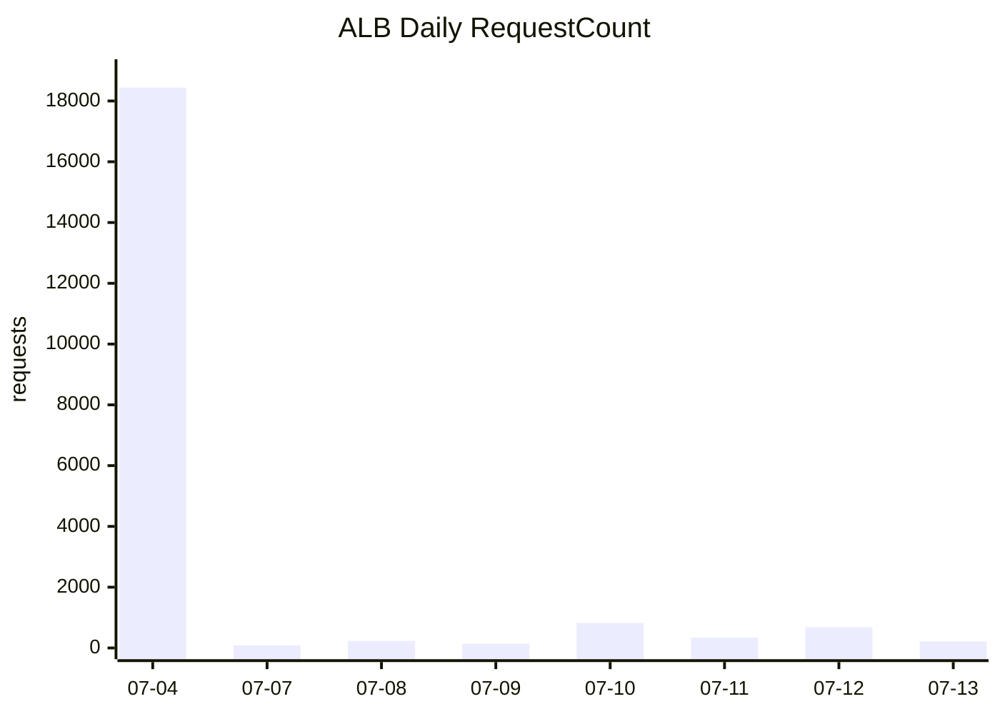
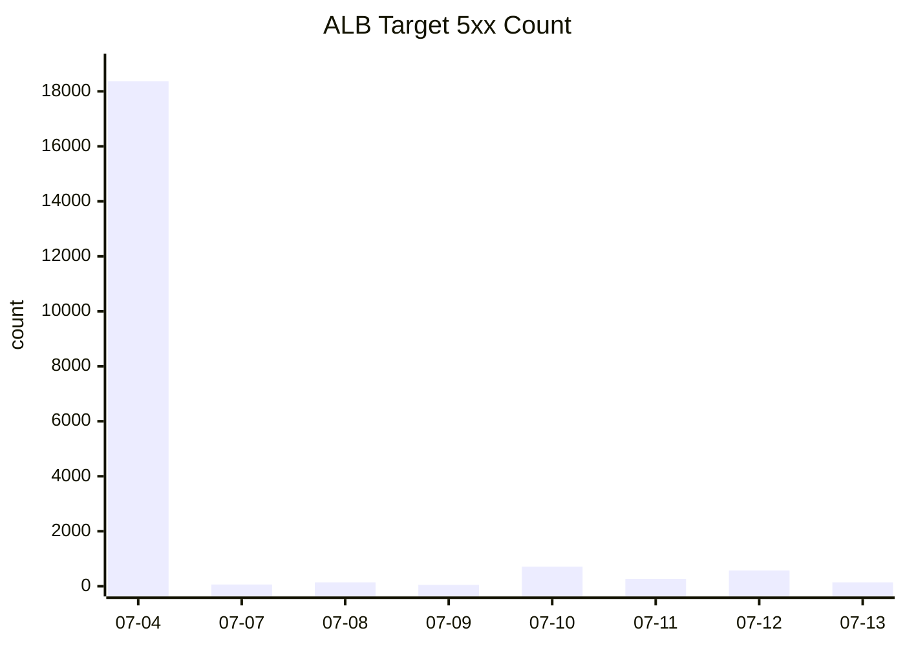

# Gonggong AWS Deployment Case Study

## 1. 프로젝트 개요

Gonggong은 해외 쇼핑몰 상품 페이지를 분석해 리콜, 인증, 관세/HSK, 위해 성분 관련 위험 신호를 보여주는 서비스다. 사용자는 Chrome Extension을 통해 AliExpress 또는 Temu 상품 페이지에서 분석 결과를 확인하고, 백엔드 API는 상품 정보와 외부 공공 API 데이터를 조합해 리스크를 계산한다.

이 문서는 Gonggong 백엔드 API를 AWS에 배포하면서 사용한 인프라 구조, 기술 선택 이유, 주요 장애와 해결 과정을 포트폴리오 관점에서 정리한 기록이다.

## 2. 해결하려던 문제

로컬 개발 환경에서는 Spring Boot API, PostgreSQL, Chrome Extension을 한 개발 머신에서 실행할 수 있었다. 하지만 Chrome Web Store 심사와 실제 사용자 테스트를 위해서는 로컬 Docker나 개발자 PC에 의존하지 않는 공개 API 환경이 필요했다.

배포 환경은 다음 조건을 만족해야 했다.

- Spring Boot API를 안정적으로 컨테이너 실행할 수 있어야 한다.
- PostgreSQL과 pgvector를 사용할 수 있어야 한다.
- OpenAI, Safety Korea, 관세청, 화학물질 API 키를 안전하게 관리해야 한다.
- Chrome Extension에서 접근 가능한 공개 API endpoint가 필요하다.
- 장애 원인을 CloudWatch Logs에서 추적할 수 있어야 한다.
- 초기 demo 비용을 낮게 유지하되, 운영 환경으로 확장 가능한 구조여야 한다.

## 3. 최종 아키텍처

```text
Chrome Extension / Browser
        |
        v
Application Load Balancer
        |
        v
ECS Fargate Service - Spring Boot API
        |
        +--> RDS PostgreSQL
        +--> Secrets Manager
        +--> CloudWatch Logs
        +--> External APIs
             - OpenAI
             - Safety Korea
             - Korea Customs Service
             - Chemical API
```

AWS 배포 리전과 주요 리소스는 다음과 같다.

| 항목 | 값 |
| --- | --- |
| AWS account | `<account-id>` |
| Region | `ap-northeast-2` |
| ECS cluster | `gonggong-demo-cluster` |
| ECS service | `gonggong-demo-api` |
| ECS task definition | `gonggong-demo-api:6` |
| ECR repository | `<account-id>.dkr.ecr.ap-northeast-2.amazonaws.com/gonggong-demo-api` |
| ALB | `gonggong-demo-alb` |
| ALB DNS | `gonggong-demo-alb-1874541421.ap-northeast-2.elb.amazonaws.com` |
| RDS | `gonggong-demo-postgres` |
| CloudWatch log group | `/ecs/gonggong-demo-api` |

현재 상태 기준으로 ECS service는 삭제 준비 중이어서 `desired=0`, `running=0`이다. 과거 Chrome Web Store 심사와 smoke test 시점에는 `desired=1`, `running=1`, `pending=0` 상태로 운영 검증을 완료했다.

## 4. 사용한 기술 스택

### Application

- Java 17
- Spring Boot
- Gradle
- Spring Data JPA
- PostgreSQL
- pgvector
- Spring AI / OpenAI API
- Chrome Extension Manifest V3

### Infrastructure

- Terraform
- AWS ECS Fargate
- Amazon ECR
- Application Load Balancer
- Amazon RDS for PostgreSQL
- AWS Secrets Manager
- CloudWatch Logs
- IAM Roles and Policies
- VPC, Subnets, Route Tables, Security Groups

### Deployment

- Docker
- `linux/amd64` container image build
- ECR push
- ECS force new deployment
- ALB smoke test
- `scripts/deploy-aws.sh` 배포 자동화

## 5. 왜 ECS Fargate를 선택했나

Spring Boot API를 AWS에 배포하는 선택지는 EC2, Elastic Beanstalk, ECS Fargate, EKS, Lambda 등이 있었다.

EC2는 빠르게 시작할 수 있지만 서버 패치, Docker daemon, systemd, 로그 수집, 배포 스크립트를 직접 관리해야 한다. EKS는 확장성은 좋지만 현재 규모에는 Kubernetes 운영 복잡도가 과했다. Lambda는 Spring Boot, JPA, 장시간 HTTP API, embedding 초기화 작업과 잘 맞지 않았다.

ECS Fargate는 컨테이너 이미지만 준비하면 서버를 직접 운영하지 않고 Spring Boot API를 장시간 실행할 수 있다. ALB, Secrets Manager, CloudWatch, RDS와의 통합도 단순해 demo에서 운영형 구조로 확장하기 좋았다.

## 6. 리소스별 설계 이유

### ECR

ECS Fargate는 컨테이너 이미지를 실행한다. 따라서 Spring Boot jar를 Docker image로 빌드하고, AWS 내부에서 안전하게 pull할 수 있는 private registry가 필요했다.

ECR을 사용한 이유는 다음과 같다.

- ECS와 IAM 통합이 쉽다.
- private registry를 별도로 운영하지 않아도 된다.
- CI/CD에서 image push 대상으로 사용하기 쉽다.
- image lifecycle policy와 image scan으로 확장 가능하다.

### Application Load Balancer

ECS task를 직접 외부에 노출하지 않고 ALB를 공개 진입점으로 두었다.

ALB를 사용한 이유는 다음과 같다.

- Chrome Extension이 호출할 고정 HTTP endpoint를 제공한다.
- ECS task가 재배포되어 IP가 바뀌어도 target group이 라우팅을 처리한다.
- health check로 정상 task에만 트래픽을 전달할 수 있다.
- HTTPS, path based routing, blue/green deployment로 확장 가능하다.

현재 demo 환경은 HTTP listener를 사용했다. 운영 전환 시에는 ACM 인증서와 Route 53을 연결해 HTTPS로 전환하는 것이 다음 단계다.

### RDS PostgreSQL

프로젝트는 PostgreSQL과 pgvector를 사용한다. EC2에 PostgreSQL을 직접 설치할 수도 있지만 백업, 패치, 장애 대응, 스토리지 관리를 직접 책임져야 한다.

RDS를 사용한 이유는 다음과 같다.

- managed database로 운영 부담을 줄일 수 있다.
- backup, storage, monitoring 기능을 AWS가 제공한다.
- private subnet과 security group으로 외부 직접 접근을 차단할 수 있다.
- pgvector extension을 활성화해 embedding search를 유지할 수 있다.

demo 환경에서는 `db.t4g.micro`, single-AZ, 20GiB 구성으로 비용을 낮췄다.

### Secrets Manager

OpenAI, Safety Korea, 관세청, 화학물질 API key와 DB password는 Git, Docker image, Terraform 변수에 넣으면 안 된다.

Secrets Manager를 사용한 이유는 다음과 같다.

- secret value를 코드 저장소와 이미지에서 분리할 수 있다.
- ECS task definition에서 runtime secret injection을 사용할 수 있다.
- IAM role로 필요한 secret만 읽도록 제한할 수 있다.
- secret rotation 또는 교체 절차로 확장 가능하다.

Terraform은 secret container만 만들고 실제 secret value는 AWS CLI 또는 콘솔로 입력했다. 이렇게 한 이유는 secret value가 Terraform state에 남는 것을 피하기 위해서다.

### CloudWatch Logs

Fargate task의 stdout/stderr는 CloudWatch Logs로 보냈다.

이 구성이 없으면 task가 죽었을 때 원인을 추적하기 어렵다. 실제로 배포 중 CloudWatch 로그를 통해 루트 경로 500, RDS schema 누락, 외부 API key 형식 오류를 확인했다.

### VPC와 Security Group

Terraform은 프로젝트 전용 VPC, public subnet, private DB subnet, security group을 만들었다.

demo 비용 절감을 위해 `enable_nat_gateway=false`를 기본값으로 두었다. 이 경우 ECS task는 public subnet에서 public IP를 받지만, 앱 포트는 ECS security group에서 ALB security group으로부터의 inbound만 허용했다.

운영형 구성에서는 `enable_nat_gateway=true`로 바꾸고 ECS task를 private app subnet에 두는 것이 권장된다.

## 7. Terraform 구성

Terraform 코드는 `infra/terraform/aws`에 작성했다.

주요 파일은 다음과 같다.

| 파일 | 역할 |
| --- | --- |
| `network.tf` | VPC, subnet, route table, Internet Gateway, optional NAT Gateway |
| `security.tf` | ALB, ECS, RDS security group |
| `alb.tf` | ALB, listener, target group |
| `ecs.tf` | ECS cluster, task definition, service, IAM role, CloudWatch log group |
| `ecr.tf` | ECR repository, lifecycle policy |
| `rds.tf` | RDS PostgreSQL |
| `secrets.tf` | Secrets Manager secret containers |
| `variables.tf` | demo/prod 전환용 변수 |
| `outputs.tf` | ALB DNS, ECR URL, ECS/RDS 정보 출력 |

초기 Terraform plan 결과는 다음과 같았다.

```text
Plan: 34 to add, 0 to change, 0 to destroy.
```

생성 대상은 VPC, subnet, ALB, listener, target group, ECS cluster/service/task definition, ECR, RDS, Secrets Manager, CloudWatch Logs, IAM roles, security groups였다.

## 8. 배포 흐름

배포 흐름은 다음 순서로 정리했다.

```text
Gradle test
    -> bootJar
    -> Docker image build
    -> ECR login
    -> ECR push
    -> ECS force new deployment
    -> wait services-stable
    -> ALB smoke test
```

자동화 스크립트는 `scripts/deploy-aws.sh`에 작성했다.

주요 동작은 다음과 같다.

- ECR login
- `linux/amd64` Docker image build
- ECR push
- ECS service force new deployment
- ECS stable 대기
- 주요 API smoke test
- 배포 로그 파일 저장

검증한 endpoint는 다음과 같다.

```text
GET /                                  200 OK
GET /actuator/health                   200 OK
GET /api/demand/priority-items/top10   200 OK
GET /api/brands/test/recalls           200 OK
POST /api/seller/hsk/match             200 OK
POST /api/products/analyze             200 OK
POST /api/v1/risk-dashboard/analyze    200 OK
```

## 9. 주요 문제와 해결

### 9.1 AWS credential 미설정

Terraform plan 최초 실행 시 다음 문제가 발생했다.

```text
No valid credential sources found
```

원인은 로컬 AWS CLI credential이 설정되어 있지 않았기 때문이다. AWS CLI 설치 상태를 확인하고 credential을 설정한 뒤, 다음 IAM 사용자로 계정 확인을 완료했다.

```text
arn:aws:iam::<account-id>:user/<iam-user>
```

이후 Terraform plan과 apply가 정상적으로 진행됐다.

### 9.2 Mac arm64 이미지와 Fargate amd64 런타임 불일치

초기 Docker image는 Apple Silicon Mac에서 빌드되어 `linux/arm64` 이미지로 push되었다. ECS Fargate task는 기본적으로 `linux/amd64` 이미지를 pull하려 했고, 이로 인해 task 기동에 실패했다.

해결은 Docker build platform을 명시하는 방식으로 진행했다.

```bash
docker build --platform linux/amd64 \
  -t <account-id>.dkr.ecr.ap-northeast-2.amazonaws.com/gonggong-demo-api:latest .
```

이후 `scripts/deploy-aws.sh`에도 `docker buildx build --platform linux/amd64`를 반영해 재발을 막았다.

### 9.3 Secrets Manager 값 미입력

ECS task가 기동될 때 `CHEMICAL_API_KEY`의 `AWSCURRENT` 값을 찾지 못해 실패했다. Terraform은 secret container만 만들었고, 실제 secret value는 별도로 입력해야 하는 구조였기 때문이다.

해결은 각 secret에 실제 값을 입력하고, secret value는 출력하지 않은 채 `LastChangedDate`와 `AWSCURRENT` stage만 확인하는 방식으로 검증했다.

확인한 secret은 다음과 같다.

- `gonggong-demo/OPENAI_API_KEY`
- `gonggong-demo/SAFETY_KOREA_API_KEY`
- `gonggong-demo/CUSTOMS_API_KEY`
- `gonggong-demo/CHEMICAL_API_KEY`
- `gonggong-demo/CUSTOMS_CONFIRMATION_SERVICE_KEY`

### 9.4 빈 RDS와 `ddl-auto=validate` 충돌

운영 profile에서는 JPA 설정을 안전하게 가져가기 위해 `spring.jpa.hibernate.ddl-auto=validate`를 사용했다. 하지만 새 RDS는 빈 DB였고, 필요한 테이블이 없어서 Spring Boot startup이 실패했다.

문제의 핵심은 운영 안전성과 초기 bootstrap 사이의 충돌이었다.

해결은 demo bootstrap 단계에서만 `SPRING_JPA_HIBERNATE_DDL_AUTO=update`를 1회 적용해 schema를 생성하고, 이후 다시 `validate`로 되돌리는 방식으로 진행했다.

장기적으로는 Flyway 또는 Liquibase로 schema migration을 분리하는 것이 맞다.

### 9.5 ALB health check가 앱 부팅보다 빨리 실패

Spring Boot 앱은 초기 구동에 약 70초가 걸렸다. 하지만 ECS service에 health check grace period가 없어 ALB health check가 너무 빨리 실패했고, 정상 부팅 중인 task가 조기 종료됐다.

해결은 ECS service에 grace period를 추가하는 방식이었다.

```hcl
health_check_grace_period_seconds = var.ecs_health_check_grace_period_seconds
```

demo에서는 `180`초를 적용했다. 이후 task가 충분히 부팅한 뒤 health check를 통과했고, ECS service가 stable 상태에 도달했다.

### 9.6 RDS pgvector extension 미활성화

HSK vector search에서 다음 문제가 발생했다.

```text
Unknown type vector
relation public.hsk_vector_store does not exist
```

원인은 RDS PostgreSQL에 `vector` extension과 vector store schema가 아직 준비되지 않았기 때문이다.

해결은 one-off ECS Fargate task로 RDS에 필요한 extension을 생성하고, HSK dataset과 embedding 초기화를 1회 수행하는 방식이었다.

```sql
CREATE EXTENSION IF NOT EXISTS vector;
CREATE EXTENSION IF NOT EXISTS hstore;
CREATE EXTENSION IF NOT EXISTS "uuid-ossp";
```

초기화 시에는 다음 값을 일시적으로 켰다.

```text
SPRING_AI_VECTORSTORE_PGVECTOR_INITIALIZE_SCHEMA=true
HSK_DATASET_INITIALIZE=true
HSK_EMBEDDING_INITIALIZE=true
```

초기화 후에는 비용과 startup 시간을 줄이기 위해 모두 `false`로 복구했다.

결과적으로 공식 HSK dataset `11327`건을 적재하고 HSK vector embedding batch 저장을 완료했다.

### 9.7 외부 API key 입력 형식 오류

운영 검증 중 일부 API key 값이 잘못 저장되어 문제가 발생했다.

- `SAFETY_KOREA_API_KEY`가 실제 키 대신 placeholder 형태로 저장됨
- `CUSTOMS_CONFIRMATION_SERVICE_KEY` 앞뒤에 스마트 따옴표가 포함됨

이로 인해 HTTP header 생성 또는 query parameter 생성에서 오류가 발생했다.

해결은 두 방향으로 진행했다.

- placeholder, non-ASCII, control character가 포함된 SafetyKorea key는 미설정으로 처리
- Customs/Chemical service key setter에서 일반 따옴표와 스마트 따옴표를 제거
- SafetyKorea 상세 조회 실패가 상품 분석 전체 500으로 번지지 않도록 fallback 처리

검증 결과, 관세청 `Invalid character` 오류가 사라졌고 분석 API는 500 대신 부분 결과 또는 `UNAVAILABLE` 상태를 반환하게 되었다.

### 9.8 Chrome Extension CORS 문제

Chrome Extension에서 운영 ALB API를 호출하려면 `chrome-extension://*` origin을 허용해야 했다.

해결은 Spring Boot에 CORS 설정을 추가하고, 환경변수로 허용 origin pattern을 조정할 수 있게 했다.

기본 허용 패턴은 다음과 같다.

```text
chrome-extension://*
http://localhost:*
http://127.0.0.1:*
```

검증은 Chrome Extension origin을 넣은 `OPTIONS`, `GET`, `POST` 요청으로 진행했고, `Access-Control-Allow-Origin` 응답을 확인했다.

### 9.9 루트 URL 500 오류

브라우저에서 ALB 루트 URL `/`에 접근했을 때 내부 서버 오류처럼 보이는 문제가 있었다.

CloudWatch 로그에서 확인한 예외는 다음과 같았다.

```text
org.springframework.web.servlet.resource.NoResourceFoundException:
No static resource for request '/'.
```

실제 원인은 인프라 장애가 아니라 애플리케이션에 `/` 경로 컨트롤러가 없었던 것이다. 그런데 공통 예외 처리기가 일반 예외를 `GLOBAL_001` 500으로 감싸면서 사용자에게는 서버 오류처럼 보였다.

해결은 `HomeController`를 추가해 루트 경로에서 서비스 상태 JSON을 반환하도록 수정하는 방식이었다.

```json
{
  "service": "gonggong-api",
  "status": "UP",
  "endpoints": [
    "/actuator/health",
    "/api/demand/priority-items/top10",
    "/api/products/analyze",
    "/api/v1/risk-dashboard/analyze"
  ]
}
```

테스트도 함께 추가했고, `./gradlew test --no-daemon` 성공 후 ECR push와 ECS force deployment를 다시 수행했다.

### 9.10 ECR push 중 EOF

`docker buildx build --push` 중 ECR registry 요청이 `EOF`로 실패한 적이 있었다.

코드나 Dockerfile 문제가 아니라 registry 인증 또는 네트워크 handshake가 중간에 끊긴 전송 오류로 판단했다.

해결은 Docker registry session을 정리하고 ECR에 재로그인한 뒤, 로컬에 생성된 이미지를 `docker push`로 재시도하는 방식이었다.

```bash
docker logout <account-id>.dkr.ecr.ap-northeast-2.amazonaws.com

aws ecr get-login-password --region ap-northeast-2 \
  | docker login --username AWS --password-stdin \
    <account-id>.dkr.ecr.ap-northeast-2.amazonaws.com

docker push <account-id>.dkr.ecr.ap-northeast-2.amazonaws.com/gonggong-demo-api:latest
```

재시도 후 push가 성공했고, ECS 새 배포까지 완료했다.

## 10. 검증 결과

최종 운영 검증 시점의 결과는 다음과 같다.

- Docker image build 성공
- ECR push 성공
- ECS force new deployment 성공
- ECS service stable 확인
- ALB health check 통과
- Chrome Extension origin CORS 확인
- 주요 API smoke test 통과
- CloudWatch Logs로 startup 및 외부 API 호출 로그 확인

대표 ECR image digest는 다음과 같다.

```text
sha256:d561809a172ad9fe90a3572d0995df8516fd222f76ff1a2f2d770d34715c581d
```

Chrome Extension 테스트도 함께 진행했다.

```text
node --test extension/*.test.js
41 tests passed
```

## 11. 배포 후 트래픽과 운영 지표

삭제 전 CloudWatch와 CloudTrail에서 배포 이후 운영 흔적을 확인했다. 기준 기간은 `2026-07-04`부터 `2026-07-13`까지이며, 시간대는 한국 시간 기준이다.

중요한 제한 사항이 있다. ALB access log가 꺼져 있었다.

```text
access_logs.s3.enabled=false
```

따라서 IP, User-Agent, 개별 URL path, 요청별 latency 같은 원시 접근 로그는 확인할 수 없다. 이 문서의 트래픽 자료는 CloudWatch metric의 일 단위 집계와 ECS/CloudTrail 이벤트를 기준으로 한다.

### 11.1 ALB 요청 수

ALB `RequestCount` 기준으로 집계된 요청 수는 다음과 같다.

| 날짜 | 요청 수 | 시각화 |
| --- | ---: | --- |
| 2026-07-04 | 18,441 | `##############################` |
| 2026-07-07 | 86 | `#` |
| 2026-07-08 | 232 | `#` |
| 2026-07-09 | 141 | `#` |
| 2026-07-10 | 820 | `##` |
| 2026-07-11 | 342 | `#` |
| 2026-07-12 | 687 | `##` |
| 2026-07-13 | 217 | `#` |



가장 큰 트래픽은 `2026-07-04`에 발생했다. 이 날은 Terraform apply, ECS service 생성, 반복 배포, health check 조정, 초기 장애 대응이 집중된 날이다. 사용자 트래픽이라기보다 배포 검증, ALB health check 실패, 재배포 루프, 브라우저/테스트 요청이 섞인 초기 운영 트래픽으로 해석하는 것이 맞다.

### 11.2 HTTP 응답 코드 집계

ALB가 target인 Spring Boot API에서 받은 응답 코드 집계는 다음과 같다.

| 날짜 | Target 2xx | Target 4xx | Target 5xx |
| --- | ---: | ---: | ---: |
| 2026-07-04 | 22 | 19 | 18,369 |
| 2026-07-07 | 20 | 2 | 64 |
| 2026-07-08 | 83 | 8 | 141 |
| 2026-07-09 | 88 | 0 | 51 |
| 2026-07-10 | 95 | 8 | 710 |
| 2026-07-11 | 63 | 10 | 269 |
| 2026-07-12 | 96 | 21 | 570 |
| 2026-07-13 | 66 | 9 | 142 |



`2026-07-04`의 5xx가 압도적으로 많다. 당시 기록과 맞춰 보면 다음 원인이 겹쳤다.

- 빈 RDS에서 `ddl-auto=validate`로 앱 부팅 실패
- Fargate 이미지 architecture 불일치
- Secrets Manager 값 미입력
- health check grace period 부재로 부팅 중 task 조기 종료
- `/` 루트 URL 미구현 및 공통 예외 처리로 인한 500 응답

ALB 자체가 생성한 5xx도 별도로 존재했다. 이는 target이 없거나 healthy target이 없는 구간에서 ALB가 직접 반환한 오류로 해석된다.

| 날짜 | ALB 자체 5xx |
| --- | ---: |
| 2026-07-04 | 278 |
| 2026-07-05 | 19,198 |
| 2026-07-06 | 204 |
| 2026-07-07 | 134 |
| 2026-07-13 | 1 |

이 수치는 앱 target이 반환한 5xx와 구분된다. 특히 `2026-07-05`의 ALB 자체 5xx는 RDS stop 또는 healthy target 부재 구간과 연결될 가능성이 높다.

### 11.3 응답 시간

ALB `TargetResponseTime`은 대부분 낮았다. 다만 일부 날짜에는 최대 응답 시간이 크게 튀었다.

| 날짜 | 평균 응답시간 | 최대 응답시간 |
| --- | ---: | ---: |
| 2026-07-04 | 0.020s | 29.791s |
| 2026-07-07 | 0.084s | 2.448s |
| 2026-07-08 | 0.004s | 0.041s |
| 2026-07-09 | 0.972s | 24.067s |
| 2026-07-10 | 0.004s | 0.052s |
| 2026-07-11 | 0.013s | 2.253s |
| 2026-07-12 | 0.004s | 0.032s |
| 2026-07-13 | 0.501s | 23.857s |

평균은 대체로 낮지만 최대값이 높은 날이 있다. 이는 외부 공공 API 호출, 초기화 작업, 실패 중인 요청의 timeout과 관련된 것으로 보는 것이 자연스럽다. ALB access log가 꺼져 있어 어떤 path에서 최대 지연이 발생했는지는 확정할 수 없다.

### 11.4 ECS 사용량

ECS service의 CPU 평균은 대부분 1% 미만이었다. 메모리는 평균 38~44% 수준으로 유지됐다.

| 날짜 | ECS CPU avg | ECS CPU max | Memory avg | Memory max |
| --- | ---: | ---: | ---: | ---: |
| 2026-07-04 | 6.71% | 100.00% | 37.65% | 50.39% |
| 2026-07-05 | 0.27% | 0.28% | 43.26% | 43.26% |
| 2026-07-07 | 0.99% | 100.00% | 37.88% | 39.21% |
| 2026-07-08 | 0.36% | 13.94% | 38.61% | 39.75% |
| 2026-07-09 | 0.36% | 39.19% | 40.47% | 43.26% |
| 2026-07-10 | 0.35% | 21.78% | 43.65% | 43.75% |
| 2026-07-11 | 0.48% | 100.00% | 40.49% | 43.85% |
| 2026-07-12 | 0.32% | 8.98% | 39.30% | 39.65% |
| 2026-07-13 | 0.34% | 23.80% | 39.94% | 42.19% |

CPU max가 100%까지 오른 날은 배포, task 교체, startup, embedding 또는 외부 API 관련 작업이 있었던 날이다. 지속적인 CPU 병목으로 보이지는 않는다.

### 11.5 RDS 사용량

RDS `gonggong-demo-postgres`는 `db.t4g.micro`, 20GiB, single-AZ, private access 구성이다.

| 날짜 | RDS CPU avg | RDS CPU max | DB connections avg | DB connections max |
| --- | ---: | ---: | ---: | ---: |
| 2026-07-04 | 4.51% | 49.27% | 10.15 | 30 |
| 2026-07-07 | 3.77% | 43.75% | 10.06 | 20 |
| 2026-07-08 | 3.36% | 5.97% | 10.00 | 10 |
| 2026-07-09 | 3.44% | 7.41% | 10.00 | 10 |
| 2026-07-10 | 3.47% | 6.13% | 10.00 | 10 |
| 2026-07-11 | 3.55% | 6.00% | 9.88 | 10 |
| 2026-07-12 | 3.58% | 5.99% | 10.00 | 10 |
| 2026-07-13 | 3.58% | 5.84% | 9.96 | 10 |

초기 배포일의 CPU max와 connection max가 높고, 이후에는 안정적인 낮은 부하로 유지됐다. connection 평균이 10 안팎인 것은 Spring Boot connection pool의 기본 유지 연결과 관련된 것으로 보인다.

### 11.6 AWS 내부 작업 이력

CloudTrail에서 확인한 주요 관리 이벤트는 다음과 같다.

| 시간 | 이벤트 | 의미 |
| --- | --- | --- |
| 2026-07-04 17:10 | `CreateCluster` | ECS cluster 생성 |
| 2026-07-04 17:10 | `CreateRepository` | ECR repository 생성 |
| 2026-07-04 17:10 | `CreateTargetGroup` | ALB target group 생성 |
| 2026-07-04 17:10 | `CreateDBInstance` | RDS PostgreSQL 생성 |
| 2026-07-04 17:17 | `CreateService` | ECS service 생성 |
| 2026-07-04 17:50~23:54 | `UpdateService` 반복 | task definition/env/health check/배포 설정 조정 |
| 2026-07-04 23:54 | `StopDBInstance` | 비용 절감을 위해 RDS 중지 |
| 2026-07-07 12:19 | `StartDBInstance` | 배포 재개를 위해 RDS 시작 |
| 2026-07-07 12:19 | `UpdateService` | ECS service 재배포 |
| 2026-07-07 21:14 | `UpdateService` | 루트 URL 500 수정 이미지 반영 |
| 2026-07-13 13:03 | `UpdateService` | 삭제 준비로 desired count 0 적용 |

ECS service 이벤트에서도 `2026-07-13 13:04`에 실행 중이던 task가 stop되고 target group에서 deregister된 것이 확인된다.

```text
2026-07-13 13:04:03  stopped 1 running task
2026-07-13 13:04:13  deregistered 1 target
2026-07-13 13:04:13  reached a steady state
```

즉, 삭제 전 현재 상태는 “서비스 리소스는 남아 있지만 Fargate task는 0개로 내려간 상태”다.

## 12. 비용과 보안 트레이드오프

이번 환경은 demo와 Chrome Web Store 심사를 위해 비용을 낮추는 쪽에 무게를 두었다.

demo 설정:

```hcl
environment        = "demo"
enable_nat_gateway = false
desired_count      = 1
task_cpu           = 512
task_memory        = 1024
certificate_arn    = ""
```

이 설정은 NAT Gateway 비용을 피할 수 있지만, ECS task가 public subnet에서 public IP를 가진다. 다만 security group에서 앱 포트 inbound를 ALB security group으로 제한해 직접 접근 위험을 줄였다.

운영 전환 시 권장 설정:

```hcl
environment         = "prod"
enable_nat_gateway  = true
desired_count       = 2
skip_final_snapshot = false
certificate_arn     = "arn:aws:acm:..."
```

운영 전환 시 추가로 필요한 작업은 다음과 같다.

- Route 53 또는 외부 DNS 연결
- ACM 인증서 발급 및 HTTPS 적용
- ECS task private subnet 배치
- NAT Gateway 사용
- RDS Multi-AZ 검토
- ECS autoscaling
- CloudWatch alarms
- ALB access log 저장
- WAF 검토
- Terraform remote backend 구성
- Flyway 또는 Liquibase 도입

## 13. 삭제 완료 상태

2026-07-13 기준으로 demo AWS 리소스 정리를 완료했다. 삭제는 최종 스냅샷 없이 진행했고, RDS automated snapshot도 최종 확인 시 더 이상 조회되지 않았다.

| 리소스 | 삭제 상태 |
| --- | --- |
| ECS service `gonggong-demo-api` | 삭제 완료 |
| ECS cluster `gonggong-demo-cluster` | 삭제 완료 |
| ECS task definition `gonggong-demo-api:1~6` | 삭제 진행 후 잔여 없음 |
| ALB `gonggong-demo-alb` | 삭제 완료 |
| Target group `gonggong-demo-api` | 삭제 완료 |
| ECR repository `gonggong-demo-api` | 삭제 완료 |
| CloudWatch log group `/ecs/gonggong-demo-api` | 삭제 완료 |
| RDS `gonggong-demo-postgres` | 최종 스냅샷 없이 삭제 완료 |
| RDS automated snapshots | 잔여 없음 |
| Secrets Manager `gonggong-demo/*` | 복구 기간 없이 삭제 완료 |
| IAM roles `gonggong-demo-ecs-task*` | 삭제 완료 |
| Security groups `gonggong-demo-*-sg` | 삭제 완료 |
| VPC `gonggong-demo-vpc` 및 subnet/route/IGW | 삭제 완료 |

삭제 후 확인한 주요 조회 결과는 모두 빈 값이었다.

```text
ECS cluster: none
ALB: none
Target group: none
ECR repository: none
RDS instance: none
RDS snapshot: none
VPC tag Project=gonggong, Environment=demo: none
IAM role prefix gonggong-demo: none
CloudWatch log group /ecs/gonggong-demo: none
Secrets Manager prefix gonggong-demo/: none
```

## 14. 배운 점

이번 배포에서 가장 큰 문제는 단순히 AWS 리소스를 만드는 것이 아니라, 애플리케이션의 운영 조건을 인프라에 맞춰 조정하는 것이었다.

특히 다음 지점이 중요했다.

- Apple Silicon 환경에서는 배포 대상 architecture를 명시해야 한다.
- Secrets Manager는 secret resource 생성과 secret value 입력을 구분해야 한다.
- 운영 profile의 `ddl-auto=validate`는 안전하지만, 초기 DB bootstrap 전략이 필요하다.
- Spring Boot startup 시간이 긴 경우 ECS health check grace period가 필요하다.
- pgvector는 RDS 생성만으로 끝나지 않고 DB extension과 vector store 초기화가 필요하다.
- 외부 공공 API는 key 형식 오류, placeholder, partial failure를 방어해야 한다.
- CloudWatch Logs는 배포 장애 분석의 핵심 도구다.
- demo 비용 최적화와 운영 보안은 서로 다른 목표이며, Terraform 변수로 전환 가능하게 설계하는 것이 좋다.

결과적으로 Gonggong 백엔드는 로컬 개발 환경에서 벗어나 AWS ECS Fargate 기반의 공개 API로 배포되었고, Chrome Extension이 실제 운영 ALB를 호출하는 흐름까지 검증했다.
